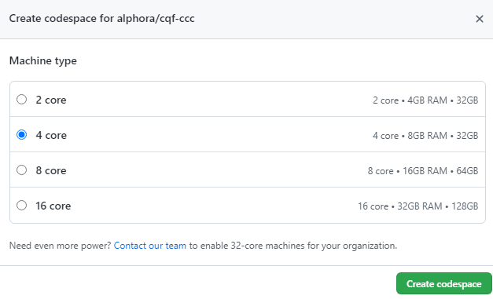

# Breast Cancer Concepts

An example FHIR artifact library that illustrates a CPG-on-FHIR approach to
knowledge engineering applied to Breast Cancer.

The concepts in this artifact library are extracted from the FHIR translation of the
currently published Breast Cancer Screening electronic Clinical Quality Measure (eCQM),
CMS-130. The concepts were abstracted and expressed using CPG-on-FHIR profiles and
approaches, with the goal of illustrating how shareable libraries of clinical knowledge
can be used in various domains including quality measurement, decision support, case-reporting,
and others.

## Walkthrough

For a complete walkthrough of building, and modifying this artifact library, refer to the [Walkthrough](WALKTHROUGH.md) page.

> TIP: To open the Walkthrough in Preview mode for easier viewing and navigation, right-click on the WALKTHROUGH.md file in the explorer pane to the left and select `Open Preview`.

## Setting Up

This walkthrough is focused on using [codespaces](https://github.com/features/codespaces) to allow participants a completely browser-based experience. For a similar walkthrough using desktop tooling, refer to the [Sample Content IG Walkthrough](https://github.com/cqframework/content-ig-walkthrough).

### Codespaces

Codespaces is a feature of Github, so the first step is to sign up for a [Github Account](https://github.com/signup). If you already have a github account, you can use codespaces to work through the walkthrough.

### Open the Codespace

Once you have a github account, you will be able to open the Breast Cancer Concepts repository in a codespace. To do this, navigate to the [Breast Cancer Concepts repository](https://github.com/cqframework/cqf-bcc), click on the green `Code` dropdown, and click on the `New codespace` button:

When creating a new codespace, you need to specify the size of the machine. Just accept the default setting of 4 cores, 8GB of RAM and 32GB of disk space:

This will open the codespace in your browser. While the codespace is initializing, a message will be displayed. Note that while it's loading, there is a green button at the bottom of the screen that allows you to `Open this codespace in VS Code desktop`. This option requires additional setup to run locally, so don't choose that unless you're sure you have all the prerequisites installed; just allow the codespace to continue initializing:

The first time you build a codespace, this process can take quite a bit of time, so be sure to give it adequate time to complete. This is also a step that can be taken prior to the workshop so you're ready to go.

Once the codespace setup is complete, you will be presented with a codespace view of the environment:

This environment has everything you need to author, validate, build, test, and package FHIR- and CQL-based knowledge artifacts. To start the walkthrough, open [WALKTHROUGH.md](WALKTHROUGH.md) in preview and follow the instructions there.

If you have already created a codespace, it will be listed in the Codespaces tab of the Code dropdown.

